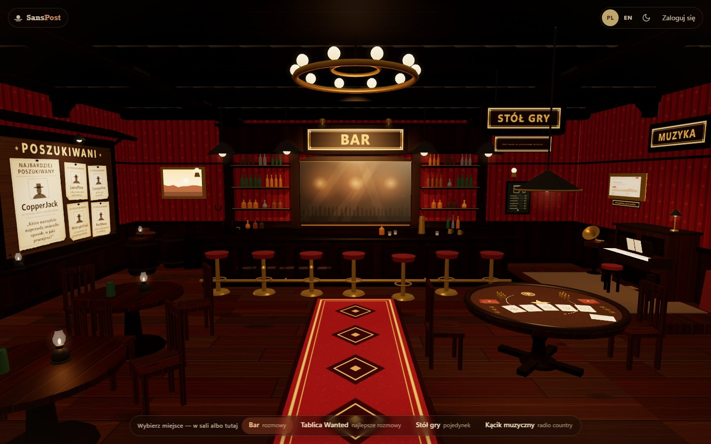
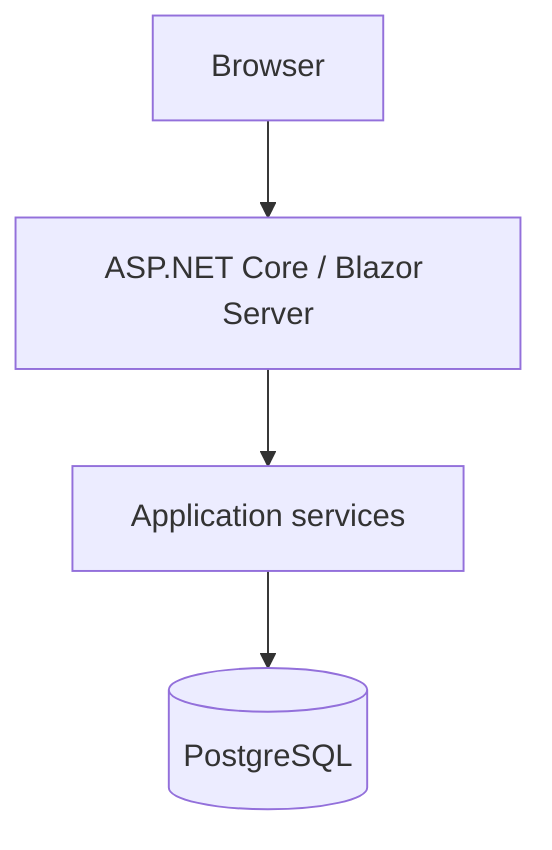
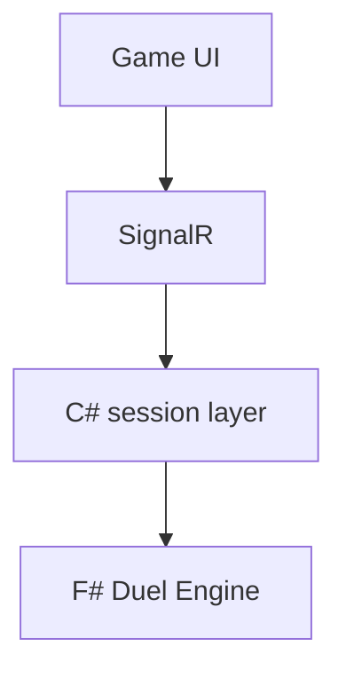
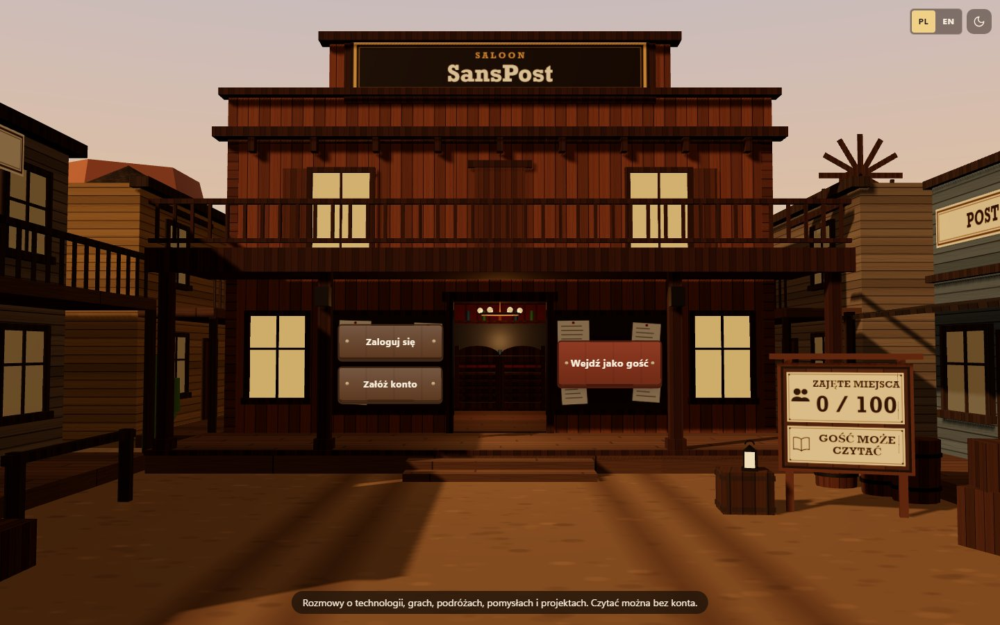
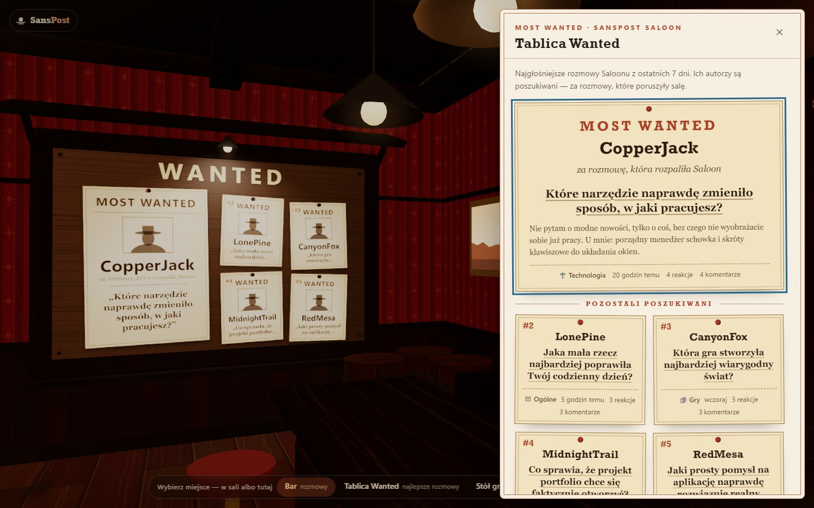
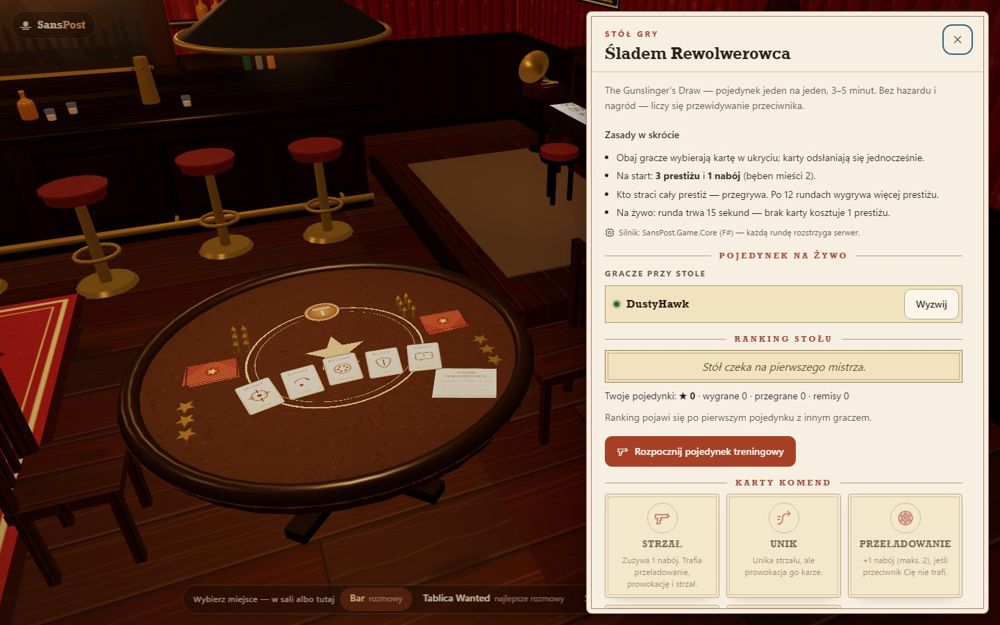
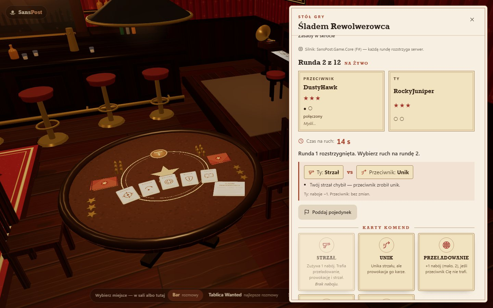

# SansPost

SansPost is a production-deployed real-time social platform presented as an interactive western saloon.

It combines a .NET backend, an F# domain engine, PostgreSQL persistence, SignalR real-time communication
and a Three.js interactive 3D environment.

[](https://sanspost.byst.re)


## Live Demo

**https://sanspost.byst.re**

The application can be explored as a guest.
Registration unlocks interactions and real-time duels.

The interface is available in Polish (default) and English — the language switcher is in the top bar.



## Key Features

### Saloon / BAR
- conversations in topic categories, newest and popular feeds,
- PostgreSQL full-text search,
- comment threads opened inside the 3D hall (deep-linkable, browser back works),
- reactions,
- notifications about new comments.

### Wanted Board
- ranked conversations of the last 7 days (backfilled with recent ones when the week is quiet), drawn on the 3D board
  and listed in a panel,
- built from real application data — score = reactions + published comments, explainable tie-breaks,
- moderation rules apply — hidden or deleted posts never appear and suspended or banned authors are not promoted,
- one highlighted post per author.

### Music Corner
- live country stations discovered through the Radio Browser API,
- browser-direct audio streaming — the server only lists stations, the stream never passes through SansPost,
- controlled playback lifecycle: one audio element for the whole session, playback survives navigation,
  pause closes the stream, at most 2 hours of active playback before a deliberate restart.

### The Gunslinger's Draw
- pure F# duel engine (`SansPost.Game.Core`),
- SignalR real-time PvP (1v1),
- simultaneous hidden moves — the opponent sees *that* you chose, not *what*,
- reconnect handling with a disconnect grace window,
- server-authoritative timers,
- surrender and rematch,
- prestige stars, leaderboard and the "Master of the Table".

## Technology

| Area | Stack |
|---|---|
| Backend | .NET 8, C#, ASP.NET Core, Blazor Server, Entity Framework Core |
| Domain | F# |
| Data | PostgreSQL |
| Real-time | SignalR |
| 3D / UI | Three.js, JavaScript, HTML, CSS |
| Infrastructure | Docker, Caddy, HTTPS, health checks |

## Architecture

SansPost is a **modular monolith**:

- a C# application/infrastructure layer (Blazor UI, REST API, application services, EF Core),
- a pure F# duel domain with no ASP.NET, EF Core or SignalR dependency,
- PostgreSQL persistence,
- SignalR as the real-time transport for duels,
- a client-side Three.js 3D scene,
- Docker deployment behind a Caddy reverse proxy.





The C# session layer owns concurrency, timers and persistence; every rule decision is delegated to the F# engine,
which works on immutable state and returns typed results instead of throwing exceptions for game rules.

## Engineering Highlights

- **Concurrency-safe business operations** — atomic PostgreSQL upserts and row locks; parallel requests never exceed a limit.
- **Persistent daily quotas** — per user per UTC day: 10 posts, 20 comments, 15 started games; a duel consumes both
  players' quota or neither; HTTP 429 with stable error codes.
- **Public/demo account capacity management** — a fixed number of public accounts, registrations serialized
  across instances; seeded demo and admin accounts do not take public slots.
- **Server-authoritative multiplayer state** — clients send intents, the server validates them against the engine and
  sends per-player views that never contain the opponent's hidden card.
- **Reconnect handling** — a refresh or a second tab resumes the same duel; losing the last connection starts a grace window.
- **PostgreSQL full-text search** with keyset pagination.
- **Idempotent seeding** — demo content is created exactly once, even when several instances start at the same time.
- **Production health checks** — `/health/live` and `/health/ready` (database only; external radio outages never mark
  the app unhealthy).
- **Structured logs** — JSON logs with request IDs, no passwords, tokens or cookies.
- **PL/EN localization** — switching languages in place keeps the session, the open duel, the radio and the 3D scene.
- **Responsive UI** — from 1440 px desktop down to 360 px phones, with a CSS/HTML fallback when WebGL is unavailable.
- **Accessibility checks** — keyboard navigation, screen-reader names, axe-core with no critical or serious issues on
  the main screens.
- **Render-on-demand Three.js scene** — the animation loop sleeps when nothing changes.

## Production Deployment

SansPost is deployed as a containerized production application with PostgreSQL, Caddy and HTTPS.

- runtime-only, non-root application image; database migrations applied on start,
- Caddy as the TLS reverse proxy (automatic certificates, zstd/gzip),
- security headers with a strict Content Security Policy, cookie authentication for the UI and JWT for the REST API,
- rate limiting, health checks, Docker log rotation, backup and restore-check scripts.

Live: **https://sanspost.byst.re**

The full deployment guide (environment, secrets, first administrator, HTTPS, backups, updates, rollback) is in
[DEPLOYMENT.md](DEPLOYMENT.md) (Polish).

## Testing

800+ automated tests across the solution:

| Layer | Project / scope |
|---|---|
| F# domain tests | `SansPost.Game.Core.Tests` — full card matrix, timeouts, forfeits |
| Unit tests | `SansPost.Tests` — services, API, auth, localization completeness |
| PostgreSQL integration tests | Testcontainers — migrations, full-text search, feeds, demo seed, quota and capacity races |
| Security tests | authorization, cookies, rate limits, startup validation, security headers / CSP |
| SignalR tests | `DuelHub` over TestServer — authentication, events, second tab, grace and resume |
| E2E tests | Playwright — guest and user journeys, BAR, Wanted, Music, live duels with two browsers, PL/EN |
| Accessibility checks | axe-core on the main screens, light/dark, PL/EN |

```bash
dotnet test SansPost.Game.Core.Tests
dotnet test SansPost.Tests      # needs Docker (Testcontainers PostgreSQL)
dotnet test SansPost.E2E        # needs Docker and Playwright Chromium
```

## Status

**SansPost v1.0** — production deployed.

The v1.0 scope is complete. Future functionality is treated as post-v1 backlog, not unfinished v1 work.

SansPost started as a small academic database project and was later rebuilt into the current production-deployed system.

## Screenshots

| Entrance | Wanted Board |
|---|---|
|  |  |
| **Game Table** | **Live duel** |
|  |  |

## Run Locally

**Docker Compose** (production-like: Caddy with TLS → app → PostgreSQL). Requires Docker with Compose v2.

```bash
git clone https://github.com/M1ke2017/SansPost.git
cd SansPost
cp .env.example .env              # optional: SANSPOST_SEED_CONTENT=true for starter conversations
mkdir -p secrets
openssl rand -hex 24    | tr -d '\r\n' > secrets/postgres_password
openssl rand -base64 48 | tr -d '\r\n' > secrets/jwt_key
docker compose build
docker compose up -d
```

Open https://localhost (Caddy uses its local certificate authority for `localhost`). Secrets live only in `secrets/`
and `.env`, both ignored by Git. Creating the first administrator is described in [DEPLOYMENT.md](DEPLOYMENT.md).

**.NET SDK** (development): .NET 8 SDK and a PostgreSQL database.

```bash
dotnet user-secrets set "ConnectionStrings:DefaultConnection" "Host=localhost;Database=sanspost;Username=postgres;Password=<your password>" --project SansPost
dotnet user-secrets set "Jwt:Key" "<random string, at least 32 bytes>" --project SansPost
dotnet run --project SansPost --launch-profile http   # applies migrations
```

## Repository Structure

| Path | Purpose |
|---|---|
| `SansPost/` | ASP.NET Core application — Blazor UI, REST API, SignalR hub, EF Core, Three.js scenes in `wwwroot`. |
| `SansPost.Game.Core/` | Pure F# duel engine — the rules of *The Gunslinger's Draw*. |
| `SansPost.Tests/` | Unit, API, PostgreSQL integration, security and SignalR tests. |
| `SansPost.Game.Core.Tests/` | F# domain tests for the duel engine. |
| `SansPost.E2E/` | Playwright end-to-end, accessibility and visual tests. |
| `deploy/` | Caddy configuration, backup and restore-check scripts. |
| `docs/` | Screenshots and release notes. |

## Third-party

Three.js (MIT) and the SignalR JavaScript client (MIT) are vendored in `SansPost/wwwroot/lib` with their licence files.
